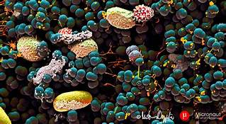

# Belly Button Biodiversity

For this project we were taksed with building an interactive dashboard to explore the Belly Button Biodiversity dataset using JavaScript, Plotly.JS, Python, HTML, CSS, Bootstrap, and Flask. The data was read from CSV files using Pandas. Interactive charts were constructed using Plotly.js. The final Flash application was deployed to Heroku.

Data Boot Camp © 2018. All Rights Reserved.
